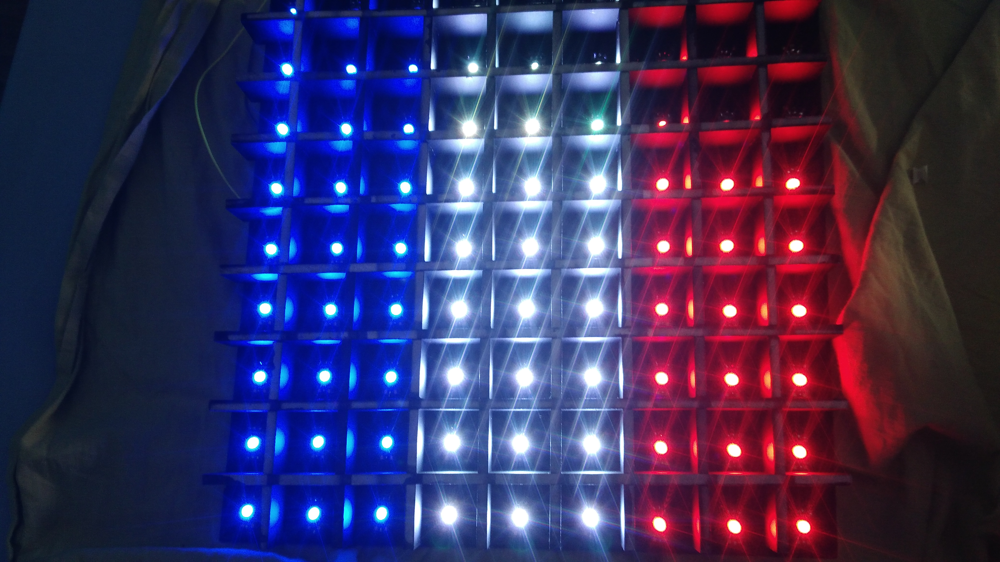

# Plateau

## Description :

Project aiming at the realization of a decorative object. Using the color of the leds and their arrangement to create animations.
Project inspired by the youtube channel GreatScott.

link : https://www.youtube.com/watch?v=D_QBlFIQk-o* 

## Materials used: ##

- Led ribbon
- Electric wires
- Wood
- Opal acrylic glass plate
- ON/OFF button
- ESP8266
- A Arduino Mega card

## Principle: ##

The arduino board controls the different leds to form an image. (The different leds come from a led ribbon).

  

The ESP8266 will allow to connect by wifi to the set using the RemoteXY application. So you can change the color of the leds with your phone.

## Future improvements: ##

Create and develop different animations and images.
Improve the application created with RemoteXY by increasing its functionalities (choice of the displayed image, creation of an image from the phone, ...)
Stop using RemoteXY and use the MIT App inventor application to create your own app.

### *Project started in 2019*